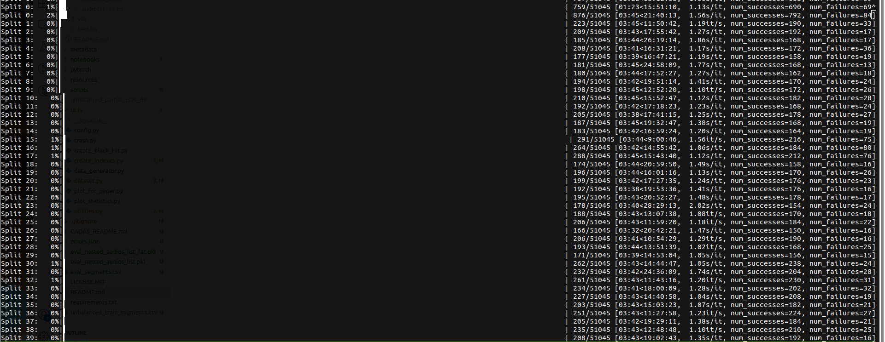

# Multiprocessing `audioset_tagging_cnn` 

I realize now that multiprocessing for this application may have been overkill... However, it has cut down the time to pack the files by a lot. 

This is a modified version of the [original repo](https://github.com/qiuqiangkong/audioset_tagging_cnn) which allows for one to pack the HDF5 files in parallel. Here is a screenshot of it in action:

